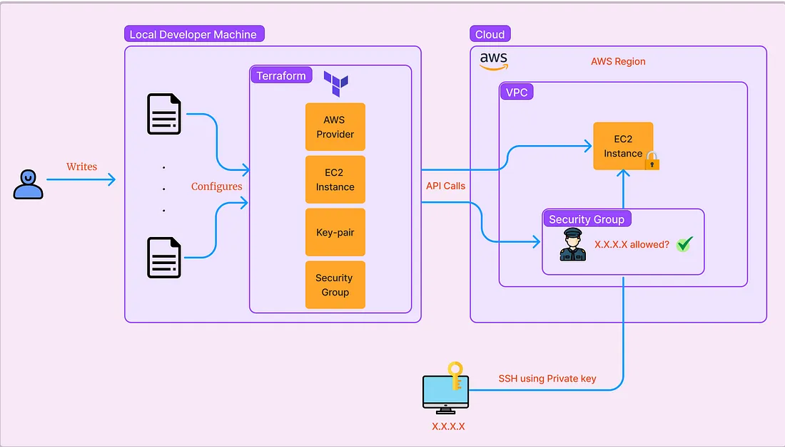

# IAC Terraform

## Aula Prática: Implementação de infraestrutura utilizando Terraform

Para seguirmos com este processo, a próxima etapa é uma vídeo-aula que você preparará para nós e nos apresentará ao vivo em uma data e horário que você puder, numa chamada de vídeo. O que acha? Serão 20 minutos de aula prática, pois nosso formato de aula é Hands on, gostaríamos de assistir uma aula sua nesse modelo!

### Parte 1 - Apresentação
- +20 Anos de carreira na área de TI
- Bacharel em Sistemas de Informação
- Especializações em:
  - Engenharia e Arquitetura de Software pela FIA
  - Ciência de Dados e Inteligência Artificial
  - Gestão de TI pela Uninter
- Já trabalhei no Vivo, UOL, HP, Embraer, Banco BV. Para o exterior trabalhei pela Broadwing e hoje na o9Solutions, empresa de IA.

### Parte 2 - O que é Terraform?
- Automatizar sua infraestrutura em cloud e serviços que rodam nela.
- Declarativa ou seja, em forma escrita com estado final desejado
- Uma ferramenta de Infrastructure as Code (IaC)
- Opensource

[Deploy AWS EC2 Instance, Key Pair, and Security Group with Terraform](https://medium.com/@sanky43jadhav/deploy-aws-ec2-instance-key-pair-and-security-group-with-terraform-fee3249078f7)

## Diagram

Source: https://medium.com/@sanky43jadhav/deploy-aws-ec2-instance-key-pair-and-security-group-with-terraform-fee3249078f7

### Parte 3 - Instalação
- [Instalação do Terraform CLI](https://developer.hashicorp.com/terraform/tutorials/aws-get-started/install-cli)
- tfenv: [GitHub - tfutils/tfenv](https://github.com/tfutils/tfenv)

### Parte 4 - Hands on
#### Configurar credenciais
Variável de ambiente:
```bash
export AWS_ACCESS_KEY_ID="your_access_key_id"
export AWS_SECRET_ACCESS_KEY="your_secret_access_key"
```

#### Criar bucket S3
```bash
aws s3api create-bucket --bucket wps-terraform-state-bucket --region us-east-1
```

#### Gerar chave SSH
```bash
ssh-keygen -t rsa -b 2048 -f my-key
```

#### Arquivo `providers.tf`
```hcl
provider "aws" {
  region = "us-east-1"
}

terraform {
  backend "s3" {
    bucket = "wps-terraform-state-bucket"
    key    = "statefile/terraform.tfstate"
    region = "us-east-1"
  }
}
```

#### Arquivo `network/main.tf`
```hcl
resource "aws_vpc" "main" {
  cidr_block = var.vpc_cidr

  tags = {
    Name = "main-vpc"
  }
}

resource "aws_subnet" "public" {
  vpc_id     = aws_vpc.main.id
  cidr_block = cidrsubnet(aws_vpc.main.cidr_block, 8, 0)

  tags = {
    Name = "public-subnet"
  }
}

resource "aws_internet_gateway" "main" {
  vpc_id = aws_vpc.main.id

  tags = {
    Name = "main-igw"
  }
}

resource "aws_route_table" "public" {
  vpc_id = aws_vpc.main.id

  route {
    cidr_block = "0.0.0.0/0"
    gateway_id = aws_internet_gateway.main.id
  }

  tags = {
    Name = "public-route-table"
  }
}

resource "aws_route_table_association" "public" {
  subnet_id      = aws_subnet.public.id
  route_table_id = aws_route_table.public.id
}
```

#### Arquivo `network/variables.tf`
```hcl
variable "vpc_cidr" {
  description = "The CIDR block for the VPC"
  type        = string
}
```

#### Arquivo `network/outputs.tf`
```hcl
output "vpc_id" {
  value = aws_vpc.main.id
}

output "public_subnet_id" {
  value = aws_subnet.public.id
}
```

#### Arquivo `variables.tf`
```hcl
variable "vpc_cidr" {
  description = "The CIDR block for the VPC"
  type        = string
  default     = "10.0.0.0/16"
}
```

#### Arquivo `security-group.tf`
```hcl
resource "aws_security_group" "allow_ports" {
  name        = "allow_ports"
  description = "allow ssh on 22 & http on port 80 443"
  vpc_id = module.network.vpc_id

  ingress {
    from_port        = 22
    to_port          = 22
    protocol         = "tcp"
    cidr_blocks      = ["0.0.0.0/0"]
  }

  ingress {
    from_port        = 80
    to_port          = 80
    protocol         = "tcp"
    cidr_blocks      = ["0.0.0.0/0"]
  }

  egress {
    from_port        = 0
    to_port          = 0
    protocol         = "-1"
    cidr_blocks      = ["0.0.0.0/0"]
  }

  tags = {
    Name = "nginx-sg"
  }  
}
```

#### Arquivo `main.tf`
```hcl
module "network" {
  source   = "./network"
  vpc_cidr = var.vpc_cidr
}

data "aws_ami" "amazon_linux" {
  most_recent = true
  filter {
    name   = "name"
    values = ["amzn2-ami-hvm-*-x86_64-gp2"]
  }
  filter {
    name   = "owner-alias"
    values = ["amazon"]
  }
  owners = ["137112412989"] # Amazon
}

resource "aws_key_pair" "deployer" {
  key_name   = "my-key"
  public_key = file("${path.module}/my-key.pub")
}

resource "aws_instance" "nginx" {
  ami           = data.aws_ami.amazon_linux.id
  instance_type = "t2.micro"
  subnet_id     = module.network.public_subnet_id
  associate_public_ip_address = true
  key_name      = aws_key_pair.deployer.key_name
  vpc_security_group_ids = ["${aws_security_group.allow_ports.id}"]

  user_data = file("scripts/install_nginx.sh")

  tags = {
    Name = "nginx-server"
  }
}
```

#### Arquivo `outputs.tf`
```hcl
output "vpc_id" {
  value = module.network.vpc_id
}

output "subnet_id" {
  value = module.network.public_subnet_id
}

output "instance_public_ip" {
  value = aws_instance.nginx.public_ip
}
```

#### Arquivo `scripts/install_nginx.sh`
```bash
#!/bin/bash
sudo yum update -y
sudo amazon-linux-extras install nginx1.12 -y
sudo systemctl start nginx
sudo systemctl enable nginx
```

### Parte 5 - Deploy/Test/Destroy
```bash
terraform plan
terraform apply
curl http://public_ip
terraform destroy

